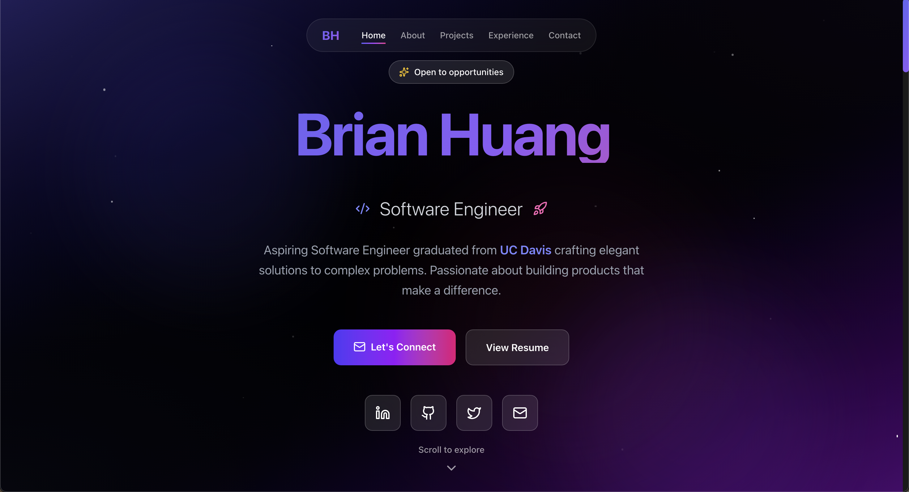
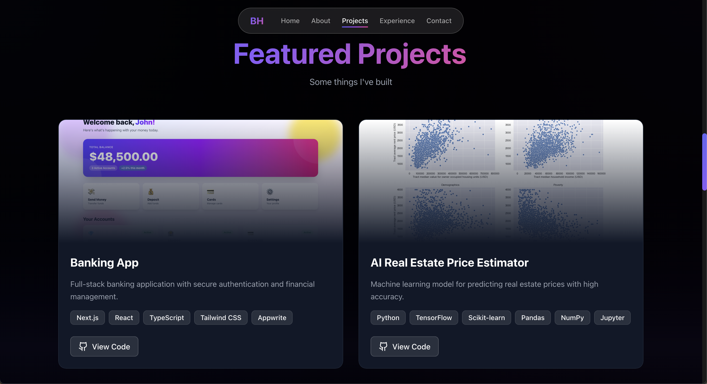

<div align="center">

# 🚀 Brian Huang's Portfolio

### Modern • Responsive • Elegant

[](https://bryhuang9.github.io)
[](https://nextjs.org/)
[](https://www.typescriptlang.org/)
[](LICENSE)

*A stunning portfolio showcasing my journey as a Software Engineer*

[View Live Demo](https://bryhuang9.github.io) • [Report Bug](https://github.com/bryhuang9/bryhuang9.github.io/issues) • [Request Feature](https://github.com/bryhuang9/bryhuang9.github.io/issues)

</div>

---

## ✨ Features

<table>
<tr>
<td>

### 🎨 Design
- ✅ **Modern UI/UX** - Glassmorphism & gradient effects
- ✅ **Dark Theme** - Elegant dark mode design
- ✅ **Smooth Animations** - Framer Motion powered
- ✅ **Responsive Design** - Mobile-first approach
- ✅ **Interactive Elements** - Hover effects & transitions

</td>
<td>

### ⚡ Performance
- ✅ **Next.js 16** - Latest framework features
- ✅ **Static Export** - Fast page loads
- ✅ **Optimized Images** - WebP & lazy loading
- ✅ **Code Splitting** - Minimal bundle size
- ✅ **60 FPS Animations** - GPU accelerated

</td>
</tr>
</table>

## 📸 Preview

<div align="center">

### 🏠 Hero Section


### 💼 Projects Showcase  


</div>

## 🛠️ Built With

<div align="center">

| Frontend | Styling | Animation | Tools |
|----------|---------|-----------|-------|
|  |  |  |  |
| React 19 | CSS3 | Intersection Observer | ESLint |
| App Router | PostCSS | React Hooks | Git |

</div>

### Core Technologies

```json
{
  "framework": "Next.js 16",
  "language": "TypeScript 5.x",
  "styling": "Tailwind CSS 4.x",
  "animations": "Framer Motion 12.x",
  "icons": "Lucide React",
  "forms": "Formspree"
}
```

## 🚀 Getting Started

### Prerequisites

- **Node.js** 18.x or higher
- **npm** or **yarn** package manager

### Installation

1️⃣ **Clone the repository**
```bash
git clone https://github.com/bryhuang9/bryhuang9.github.io.git
cd bryhuang9.github.io
```

2️⃣ **Install dependencies**
```bash
npm install
```

3️⃣ **Run development server**
```bash
npm run dev
```

4️⃣ **Open your browser**
```
http://localhost:3000
```

### Build for Production

```bash
npm run build    # Build the application
npm run export   # Export as static site
```

## 📁 Project Structure

```
bryhuang9.github.io/
│
├── 📂 app/                      # Next.js App Router
│   ├── layout.tsx              # Root layout with metadata
│   ├── page.tsx                # Main page component
│   ├── globals.css             # Global styles & animations
│   └── favicon.ico             # Site favicon
│
├── 📂 components/              # React Components
│   ├── Navigation.tsx          # Floating navbar with active detection
│   ├── Hero.tsx                # Hero section with animated background
│   ├── About.tsx               # About me with personal details
│   ├── Projects.tsx            # Project showcase cards
│   ├── Experience.tsx          # Timeline with accordion
│   ├── Contact.tsx             # Contact form & social links
│   └── Footer.tsx              # Footer with branding
│
├── 📂 public/                  # Static Assets
│   ├── pic.png                 # Profile picture
│   ├── Resume - Brian Huang.pdf         # Resume document
│   ├── banking-app.png         # Project screenshots
│   ├── realestate.png
│   └── ...                     # Other images & icons
│
├── 📂 .github/workflows/       # GitHub Actions
│   └── deploy.yml              # Auto-deployment workflow
│
├── 📄 next.config.ts           # Next.js configuration
├── 📄 tailwind.config.ts       # Tailwind configuration
├── 📄 tsconfig.json            # TypeScript configuration
└── 📄 package.json             # Dependencies & scripts
```

## 🎨 Customization Guide

### Update Personal Information

1. **About Section** (`components/About.tsx`)
```typescript
const details = [
  { icon: MapPin, label: 'Location', value: 'Your City' },
  { icon: GraduationCap, label: 'Education', value: 'Your University' },
  // ...
];
```

2. **Projects** (`components/Projects.tsx`)
```typescript
const projects = [
  {
    title: 'Your Project',
    description: 'Project description',
    technologies: ['React', 'Node.js'],
    github: 'https://github.com/yourusername/project',
  },
];
```

3. **Experience** (`components/Experience.tsx`)
```typescript
const experiences = [
  {
    position: 'Your Role @ Company',
    duration: 'Start - End',
    location: 'City, State',
    description: 'What you did...',
  },
];
```

### Modify Colors

Edit `app/globals.css`:
```css
.gradient-text {
  background: linear-gradient(135deg, #YourColor1, #YourColor2);
}
```

## 🌐 Deployment

### Option 1: Vercel (Recommended)

[](https://vercel.com/new/clone?repository-url=https://github.com/bryhuang9/bryhuang9.github.io)

1. Import your GitHub repository
2. Vercel auto-detects Next.js
3. Deploy! 🚀

### Option 2: GitHub Pages

Already configured! Just:

1. Go to **Settings** → **Pages**
2. Source: **GitHub Actions**
3. Push to `master` branch
4. Site deploys automatically ✅

Your site will be live at: `https://bryhuang9.github.io`

### Option 3: Netlify

```bash
npm run build
# Drag and drop the 'out' folder to Netlify
```

## 📊 Performance

<div align="center">

| Metric | Score |
|--------|-------|
| 🎨 **First Contentful Paint** | < 1.2s |
| ⚡ **Time to Interactive** | < 2.5s |
| 📦 **Bundle Size** | ~150KB |
| 🚀 **Lighthouse Score** | 95+ |

</div>

## 🔧 Scripts

| Command | Description |
|---------|-------------|
| `npm run dev` | Start development server on port 3000 |
| `npm run build` | Build production bundle |
| `npm run start` | Start production server |
| `npm run lint` | Run ESLint for code quality |
| `npm run export` | Export as static HTML |

## 📱 Browser Support

<div align="center">

| Chrome | Firefox | Safari | Edge | Mobile |
|--------|---------|--------|------|--------|
| ✅ Latest | ✅ Latest | ✅ Latest | ✅ Latest | ✅ iOS & Android |

</div>

## 🤝 Contributing

Contributions, issues, and feature requests are welcome!

1. Fork the Project
2. Create your Feature Branch (`git checkout -b feature/AmazingFeature`)
3. Commit your Changes (`git commit -m 'Add some AmazingFeature'`)
4. Push to the Branch (`git push origin feature/AmazingFeature`)
5. Open a Pull Request

## 📝 License

This project is licensed under the **MIT License** - see the [LICENSE](LICENSE) file for details.

## 💡 Acknowledgments

- Design inspiration from modern portfolio trends
- Icons by [Lucide](https://lucide.dev/)
- Animations powered by [Framer Motion](https://www.framer.com/motion/)
- Built with [Next.js](https://nextjs.org/)

## 📞 Contact

<div align="center">

**Brian Huang**

[](https://www.linkedin.com/in/brianhuang99/)
[](https://github.com/bryhuang9)
[](mailto:brian.yao.huang@gmail.com)
[](https://bryhuang9.github.io)

</div>

---

<div align="center">

### ⭐ Star this repo if you found it helpful!

Made with 💜 by Brian Huang

**[↑ Back to Top](#-brian-huangs-portfolio)**

</div>
