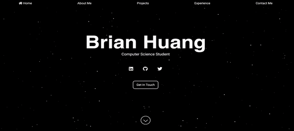

# [Your Name] Portfolio Website

This repository contains the code for my personal portfolio website. The site showcases my work, skills, and professional experience in the field of software development.

## Features

- **Professional Bio:** A brief introduction about me and my professional journey so far.
- **Projects Showcase:** A compilation of the projects I have worked on.
- **Resume:** A detailed look at my academic background, professional experience, skills, and accomplishments.
- **Contact:** A contact form for anyone looking to get in touch.

## Technologies Used

- HTML/CSS
- JavaScript

## Deployment

The website is hosted using GitHub Pages. You can access it at `https://github.com/bryhuang9/bryhuang9.github.io`.

## Contributing

Contributions, issues, and feature requests are welcome! Feel free to check the [issues page]([https://github.com/yourusername/portfolio-website/issues]).

## License

Distributed under the MIT License. See `LICENSE` for more information.

## Contact

Brian Huang - brian.yao.huang@gmail.com

Project Link: [https://github.com/bryhuang9/bryhuang9.github.io](https://github.com/bryhuang9/bryhuang9.github.io)

